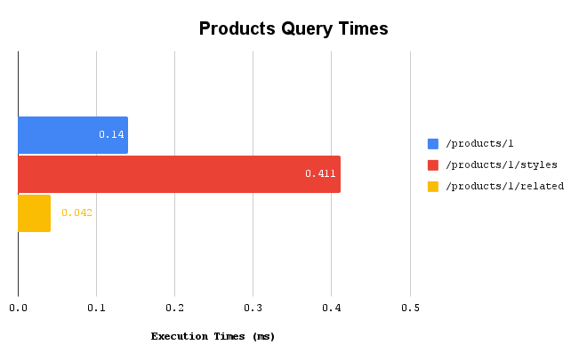
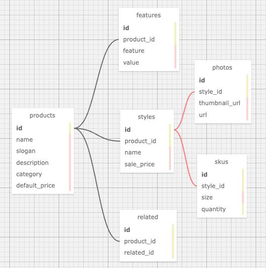

<h1 align="center">
   
  Atelier Products Service API
   
</h1>

A complete redesign and optimization of a back end system (comprised of an express server and PostgreSQL database) to meet large quanitities of data and traffic.

This section focuses on modernization of the Atelier Products API.

  
  
  
  
  
  
  
  

# Analytics:
## Products Query Times

Using indices within the PostgreSQL database, the execution times for each API endpoints decreased as follows:
  - `/products/:product_id` by 99.73% (51.257 ms to <b>0.14 ms</b>)
  - `/products/:product_id/styles` by 99.99% (6155.382 ms to <b>0.411 ms</b>)

  

- Run `psql -f server/db/query-times.sql` to run psql shell and analzye query times

## API functionality
- Run `npm run test` to do Jest testing of all products API endpoints

# Getting Started:
## Installation
- Run `npm install` to install initial dependencies
- Create a local file `.env` using `example.env` as a template.
  - `.env` is listed in the `.gitignore` file and thus will not be added to Git's source control
  - Populate this new `.env` file with the required values for your local machine
- Run `npm eslint-dev` to configure ESLint rules and check code quality and syntax

## Start Server
- Run `npm run server-dev` to start the server

## Populate PostgreSQL database
- Download CSV files for features, photos, products, related, skus, and styles in server/data
- Run `npm run etl` to transform data to correct format
- Execute `psql -f server/db/schema.sql` to populate table

  

