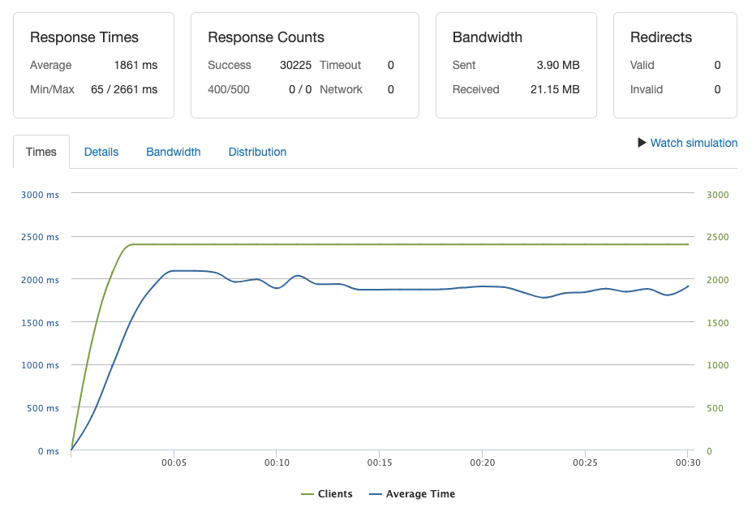
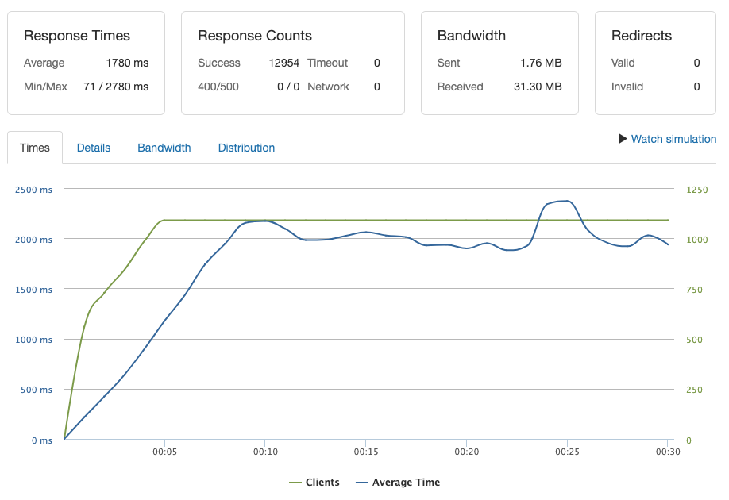
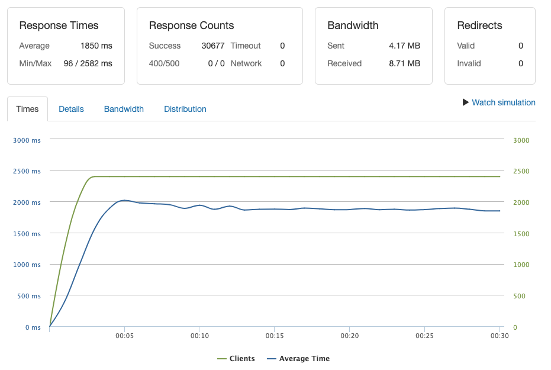

<h1 align="center">
  <br>
  Atelier Products Service API
  <br>
</h1>

A complete redesign and optimization of a back end system (comprised of an express server and PostgreSQL database) to meet large quanitities of data and traffic.

This section focuses on modernization of the Atelier Products API.

<div align='center'>
  
  
  
  
  
  
  
  
  
  
  
</div>

# API Endpoints:
  - <code>/products/:product_id</code>
  - <code>/products/:product_id/styles</code>
  - <code>/products/:product_id/related</code>

# Analytics & Testing:
## Deployed Stress Testing
<div>
  
  
</div>

<p align='center'><b>Goal</b>: ~100 RPS with <1% Error Rate and Latency Rate of <2000 ms</p>

  <div align='center'>
    
    
    
  </div>

  - `/products/:product_id` had a latency rate of 1861 ms with 0% error rate at 1007.5 RPS
  - `/products/:product_id/styles` had a latency rate of 1780 ms with 0% error rate at 431.8 RPS
  - `/products/:product_id/related` had a latency rate of 1850 ms with 0% error rate at 1022.57 RPS

  <details>
    <summary><h4>How to Run Loader.io Testing</h4></summary>
    <ol>
      <li>Deploy Server and Database</li>
      <li>Add Loader.io API Token</li>
      <li>Run Tests on Loader.io Interface</li>
    </ol>
  </details>

## Local Stress Testing 
<div>
  
</div>

<p align='center'><b>Goal</b>: ~1000 RPS with <1% Error Rate and Latency Rate of <2000 ms</p>

  - `/products/:product_id` had a latency rate of 91.11 ms and 0% error rate at 1189.79 RPS
  - `/products/:product_id/styles` had a latency rate of 1689.5 ms and 0% error rate at 1048.25 RPS
  - `/products/:product_id/related` had a latency rate of 55.72 ms and 0% error rate at 1178.61 RPS
  - Simultaneous calls to all API endpoints had a latency rate of 151.65 ms and 0% error rate at 1034.76 RPS

  <details>
    <summary><h4>How to Run K6 Local Testing</h4></summary>
    <ul>
      <li><h5>Test Each Endpoint</h5></li>
        <pre><code>k6 run k6/endpoints/products.js</code></pre>
        <pre><code>k6 run k6/endpoints/styles.js</code></pre>
        <pre><code>k6 run k6/endpoints/related.js</code></pre>
      <li><h5>Test Combined Endpoints</h5></li>
        <pre><code>k6 run k6/endpoints/all.js</code></pre>
    </ul>
  </details>
  
## API Query Response Times
<div>
  
</div>

<p align='center'><b>Goal</b>: <50 ms response time per query</p>

Using indices within the PostgreSQL database, the goal was met and the execution times of each API endpoints decreased as follows:
  - `/products/:product_id` by 99.73% (51.257 ms to <b>0.14 ms</b>)
  - `/products/:product_id/styles` by 99.99% (6155.382 ms to <b>0.411 ms</b>)
  - `/products/:product_id/related` by 99.99% (445.562 ms to <b>0.042 ms</b>)

<div>
  
</div>

<details>
    <summary><h4>How to Test Query Times</h4></summary>
    <pre><code>psql -f server/db/query-times.sql</code></pre>
</details>

## API functionality
<div>
  
  
</div>

All products API endpoints functionally tested with Postman Request
<details>
  <summary><h4>How to run Jest testing of API functionality</h4></summary>
  <pre><code>npm run test</code></pre>
</details>

# Getting Started:
## Installation
<div>
  
  
  
</div>

- Install initial dependencies
  ```
  npm install
  ```
- Create a local file `.env` using `example.env` as a template.
  - `.env` is listed in the `.gitignore` file and thus will not be added to Git's source control
  - Populate this new `.env` file with the required values for your local machine
- Configure ESLint rules and check code quality and syntax
  ```
  npm run eslint-dev
  ```

## Start Server
<div>
  
</div>

```
npm run server-dev
```

## Extract, Transform, Load (ETL)
<div>
  
  
</div>

- Download CSV files for features, photos, products, related, skus, and styles in server/data
- Transform data to correct format
  ```
  npm run etl
  ```
- Populate/Load database with the CSV files
  ```
  psql -f server/db/schema.sql
  ```

<div>
  
</div>
